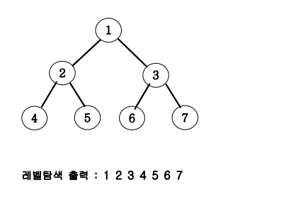
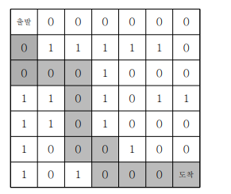

# 재귀함수

자연수 N이 입력되면 재귀함수를 이용하여 1부터 N까지를 출력하는 프로그램을 작성하세요.

<strong>알고리즘</strong> 
값이 들어오면 프린트해주고 값을 1을 줄여서 함수에 다시 넣어준다. 이때 0이되면 리턴해준다.
재귀함수를 스택을 사용한다. 그러므로 프린트 문에 따라 출력이 달라진다.(스택 프레임) 리턴을 해주면 끝났으므로 pop을 해준다. 이때 스택 프레임이므로 마지막으로 들어온 순서대로 나가게 되어 있다. 나갈 때에는 재귀를 했던 부분에서부터 다시 돌아가게 된다. 
 <u>재귀함수는 자신의 지역변수로 컨트롤 해야 한다</u>

# 재귀함수를 이용한 이진수 출력

10진수 N이 입력되면 2진수로 변환하여 출력하는 프로그램을 작성하세요.
단, 재귀함수를 이용해서 출력해야 합니다.

<strong>알고리즘</strong> 
재귀함수를 따로 만들고 solution에서 값을 출력해준다. 여기서 이진수를 표현하기 위해 string을 이용한다.

# 이진트리 순회(깊이우선탐색: DFS)

아래 그림과 같은 이진트리를 전위순회와 후위순회를 연습해보세요

<strong>알고리즘</strong> 
문제집에 코드가 있다. vx2 = 왼쪽, vx2+1 = 오른쪽 자식. 코드의 출력문의 위치에 따라 값이 달라진다.

# 중복순열 구하기

1부터 N까지 번호가 적힌 구슬이 있습니다. 이 중 중복을 허락하여 M번을 뽑아 일렬로 나열하는 방법을 모두 출력합니다.

<strong>알고리즘</strong> 
DFS 0을 호출한다. DFS는 3가닥의 호출이 일어난다.(3 2)이기 때문. 3가닥을 i로 놓고 i를 호출한다. 여기서 i = 1을 호출하면 DFS(1)이 된다. 이때 push해준다. 그럼 한번 더 3가닥의 호출이 일어나게 된다. i를 또 호출하면 DFS(2)가 된다. push를 하고 2개가 정해졌으므로 값을 출력하고 다시 DFS(1)로 돌아간다. 돌아 왔으므로 pop을 해주고 위와 같은 행동을 계속하면 된다.

# 순열 구하기

10이하의 N개의 자연수가 주어지면 이 중 M개를 뽑아 일렬로 나열하는 방법을 모두 출력합니다.

<strong>알고리즘</strong> 
중복 순열과 비슷하게 짜주지만 여기서 더 추가할 것은 자신이 사용한 숫자는 사용을 했다는 체크를 해주어야 한다. 배열을 만들어 그 값을 사용하였다면 1로 사용하지 않았다면 0으로 써준다. 0일 때만 사용할 수 있도록 해준다.

# 가장 가까운 큰수

자연수 N이 주어지면, N과 구성이 같으면서 N보다 큰 수 중 가장 작은 수를 출력하는 프로그램을 작성하세요.
구성이 같다는 말은 각 자릿수가 같은 숫자들로 이루어졌다는 의미입니다. 예를 들어 123과 231은 서로 구성이 같습니다. 하지만 123과 215는 구성이 다릅니다.

<strong>알고리즘</strong> 
위에와 같이 풀면 된다. 스택과 리스트를 이용하여 푼다. 숫자는 갯수만큼 만들어 준다. 오름차순으로 바꾸어준 다음 원래값의 다음 위치의 있는 값을 출력하면 된다.

# 조합 구하기

1부터 N까지 번호가 적힌 구슬이 있습니다. 이 중 M개를 뽑는 방법의 수를 출력하는 프로그램을 작성하세요.

<strong>알고리즘</strong> 
한번 지나간 숫자는 아래 레벨로 내려갔을 때 생략하고 가닥을 만들어준다. DFS를 짤 떄 시작숫자를 같이 넣어주면 된다. 레벨이 올라갈 때 시작숫자도 같이 올려주면 된다.

# 이진트리 레벨탐색(넓이우선탐색: BFS)

아래 그림과 같은 이진트리를 큐(Queue) 자료구조를 이용해 레벨탐색을 해보세요.

<strong>알고리즘</strong> 
레벨 당으로 본다. 0레벨이 들어가고 0레벨이 나가면 1레벨에 있는 값이 들어온다. 1레벨에 있는 두개 중 하나가 빠지면 빠진값 아래 있는 2레벨 값들이 들어오고 나머지 1레벨 값이 빠지면 빠진 1레벨 아래에 있는 2레벨 값이 들어온다.

# 송아지 찾기

현수는 송아지를 잃어버렸다. 다행히 송아지에는 위치추적기가 달려 있다. 현수의 위치와 송아지의 위치가 수직선상의 좌표 점으로 주어지면 현수는 현재 위치에서 송아지의 위치까지 다음과 같은 방법으로 이동한다. 송아지는 움직이지 않고 제자리에 있다.
현수는 스카이 콩콩을 타고 가는데 한 번의 점프로 앞으로 1, 뒤로 1, 앞으로 5를 이동할 수있다. 최소 몇 번의 점프로 현수가 송아지의 위치까지 갈 수 있는지 구하는 프로그램을 작성하세요.

<strong>알고리즘</strong> 
레벨을 스카이 콩콩을 탔을 때로 지정한다. 세가닥이 생기는데 한번의 이동으로 갈 수 있는 좌표들이다. (x+1. x-1, x+5)가 된다. 아래에 가닥을 만들텐데 만약 가지고 있는 값이 중복된다면 중복이 되지 않도록 가닥을 만들어 준다. 종북되지 않게 하기 위해 하나의 배열을 만들고 지나간 값이 나올 때마다 1로 바꾸어주어 if문으로 중복을 피할 수 있게 해준다. 이제 이 값을 이용하여 송아지가 있는 곳에 도달하게 된다면 현재 레벨이 부모 레벨이므로 자식레벨인 레벨+1 값을 리턴해준다.

# 미로의 최단거리 통로

7x7 격자판 미로를 탈출하는 최단경로의 길이를 출력하는 프로그램을 작성하세요. 경로의 길이는 출발점에서 도착점까지 가는데 이동한 횟수를 의미한다. 출발점은 격자의 (1, 1) 좌표이고, 탈출 도착점은 (7, 7)좌표이다. 격자판의 1은 벽이고, 0은 도로이다.
격자판의 움직임은 상하좌우로만 움직인다. 미로가 다음과 같다면

위와 같은 경로가 길이가 12인 최단 경로가 된다.

<strong>알고리즘</strong> 
거리를 저장하는 2차원 배열을 만들고 각 위치에 따른 거리를 넣어준다.
